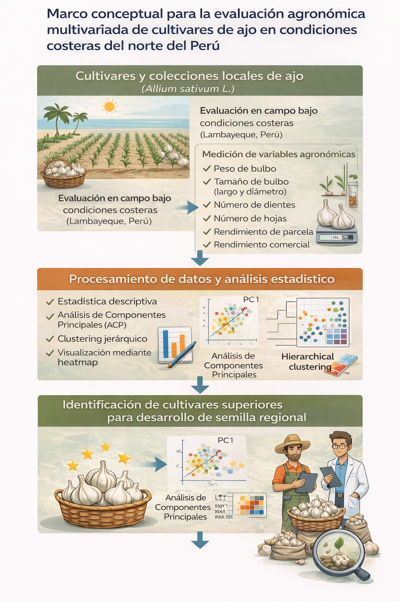
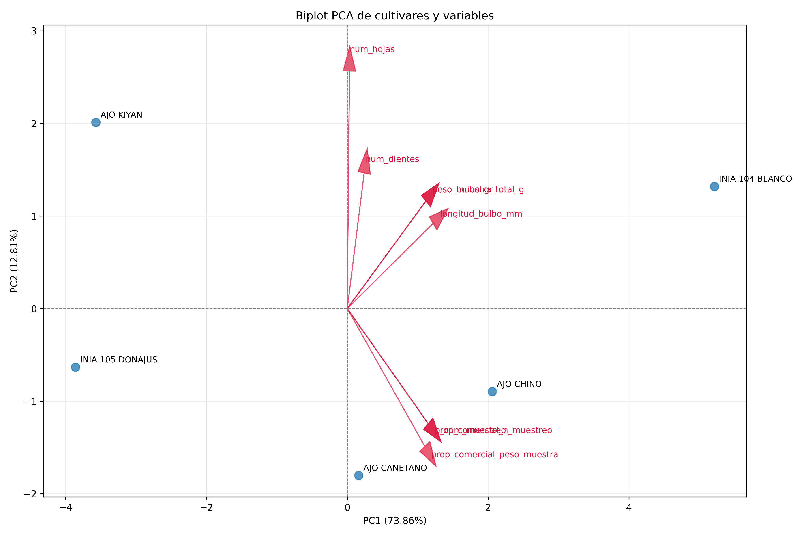
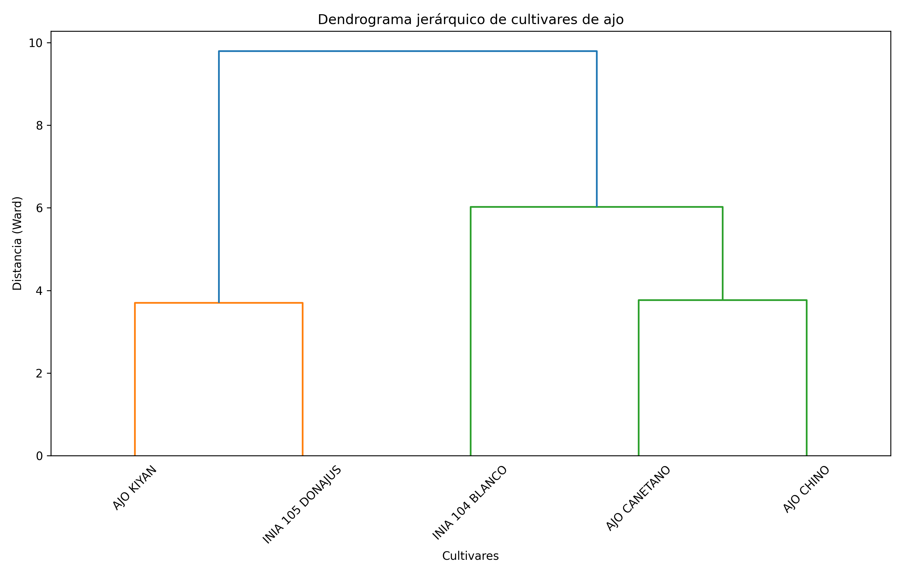
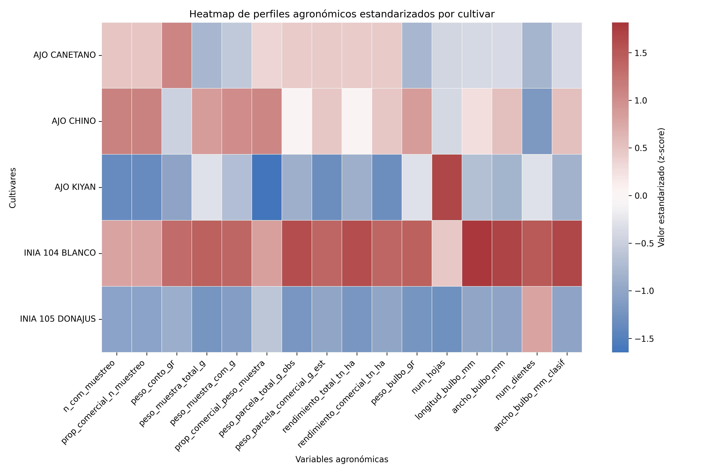

# Evaluación agronómica y análisis multivariado de cultivares de ajo (Allium sativum L.) en Lambayeque, Perú

# Agronomic evaluation and multivariate analysis of garlic cultivars (Allium sativum L.) in Lambayeque, Peru

## Resumen

El objetivo del estudio fue evaluar la adaptabilidad agronómica inicial de cultivares de ajo en condiciones costeras de Lambayeque, Perú, como base para la selección preliminar de material con potencial para el desarrollo de semilla regional. El ensayo se estableció bajo un diseño de bloques completos al azar y el procesamiento estadístico final se realizó con cinco cultivares, debido a que un tratamiento fue excluido del archivo analítico antes del ANOVA y de los análisis multivariados. Se analizaron variables de rendimiento, calidad comercial y morfología de bulbo mediante estadística descriptiva, análisis de varianza y análisis multivariado. Los resultados mostraron diferencias significativas entre cultivares para peso de bulbo, peso de muestra total y comercial, longitud y ancho de bulbo, número de dientes y número de hojas. INIA 104 BLANCO presentó los mayores promedios de peso de bulbo (64.16 g), rendimiento total (8.82 t ha^-1), rendimiento comercial (8.68 t ha^-1), longitud de bulbo (49.79 mm) y ancho de bulbo (60.79 mm). El ACP indicó que PC1 y PC2 explicaron 73.86 % y 12.81 % de la variación, respectivamente, y que los rasgos asociados con tamaño de bulbo y rendimiento fueron los principales discriminantes. El agrupamiento jerárquico separó a INIA 104 BLANCO como un perfil diferenciado, mientras que AJO KIYAN e INIA 105 DONAJUS conformaron el grupo de menor desempeño comercial. Los resultados respaldan el uso conjunto de ANOVA y herramientas multivariadas para la selección preliminar de cultivares adaptados a la costa norte del Perú.

## Palabras clave

ajo; adaptabilidad varietal; ANOVA; análisis de componentes principales; rendimiento comercial

## Abstract

The aim of this study was to evaluate the initial agronomic adaptability of garlic cultivars under coastal conditions of Lambayeque, Peru, as a basis for preliminary selection of materials with potential for a regional seed system. The trial was established under a randomized complete block design, and the final statistical dataset included five cultivars because one treatment was excluded from the analytical file before ANOVA and multivariate analyses. Yield, commercial quality, and bulb morphology variables were analyzed using descriptive statistics, analysis of variance, and multivariate methods. Significant differences among cultivars were detected for bulb weight, total and commercial sample weight, bulb length, bulb width, number of cloves, and number of leaves. INIA 104 BLANCO showed the highest means for bulb weight (64.16 g), total yield (8.82 t ha^-1), commercial yield (8.68 t ha^-1), bulb length (49.79 mm), and bulb width (60.79 mm). PCA showed that PC1 and PC2 explained 73.86% and 12.81% of total variation, respectively, with bulb size and yield traits being the main discriminating variables. Hierarchical clustering separated INIA 104 BLANCO as a distinct profile, whereas AJO KIYAN and INIA 105 DONAJUS formed the lower-performing commercial group. These results support the combined use of ANOVA and multivariate tools for preliminary selection of garlic cultivars adapted to the northern Peruvian coast.

## Keywords

garlic; varietal adaptability; ANOVA; principal component analysis; commercial yield

## 1. Introducción

El ajo (Allium sativum L.) es un cultivo hortícola de importancia económica y alimentaria, valorado por su uso culinario, medicinal y comercial. En la costa norte del Perú, particularmente en Lambayeque, la producción depende en gran medida de material vegetal no certificado, lo que incrementa la heterogeneidad del cultivo y limita la estabilidad del rendimiento y la calidad comercial de los bulbos.

La adaptación varietal constituye un componente central para mejorar la productividad del ajo en ambientes contrastantes. En ese contexto, la evaluación temprana de cultivares permite identificar materiales con mayor estabilidad productiva, mejor expresión de caracteres comerciales y potencial para programas de multiplicación de semilla. En el Perú, esta línea de trabajo aún requiere mayor evidencia experimental para sustentar recomendaciones regionales.

El presente estudio forma parte del proceso inicial de construcción de una tecnología regional de semilla de ajo para Lambayeque. Su propósito fue generar evidencia objetiva sobre el comportamiento agronómico de cultivares evaluados bajo condiciones agroclimáticas costeras, integrando análisis univariados y multivariados. La hipótesis de trabajo fue que existirían diferencias entre cultivares en rendimiento, calidad comercial y rasgos morfológicos del bulbo, y que dichas diferencias podrían resumirse mediante patrones multivariados útiles para la selección preliminar de materiales.

## 2. Materiales y métodos

### 2.1. Área de estudio

El experimento se realizó en la región Lambayeque, en la costa norte del Perú, dentro de un sistema agrícola bajo riego representativo de la zona. De acuerdo con la documentación del repositorio, el sitio experimental corresponde a la Estación Experimental Agraria Vista Florida del INIA. El ambiente se caracteriza de forma general por clima árido a semiárido, baja precipitación anual y alta radiación solar.

[PENDIENTE: completar información específica de temperatura, precipitación, tipo de suelo y características fisicoquímicas del sitio experimental.]

### 2.2. Material vegetal y diseño experimental

El objetivo experimental original del proyecto consideró seis cultivares; sin embargo, el análisis estadístico final se ejecutó con el archivo `data/processed/parcelas_cuantitativas_sin_T5.csv`, en el cual un tratamiento fue excluido previamente. En consecuencia, los resultados reportados en este manuscrito corresponden a cinco cultivares: AJO CANETANO, AJO CHINO, AJO KIYAN, INIA 104 BLANCO e INIA 105 DONAJUS.

El ensayo se condujo en campo bajo un diseño de bloques completos al azar, con cuatro bloques y una parcela por cultivar en cada bloque. La parcela fue la unidad experimental y las plantas evaluadas dentro de parcela se consideraron submuestras.

### 2.3. Manejo agronómico y variables evaluadas

Las parcelas se manejaron con prácticas agronómicas uniformes para la zona, incluyendo preparación del suelo, siembra, riego, fertilización y control fitosanitario. Se registraron variables de muestra, rendimiento, calidad comercial y morfología del bulbo: número de plantas comerciales, proporción comercial, peso de muestra total y comercial, peso total y comercial de parcela, rendimiento total y comercial, peso de bulbo, longitud de bulbo, ancho de bulbo, número de dientes y número de hojas.

La clasificación comercial se basó en el criterio documentado en `protocols/datasets.md`, considerando como comerciales los bulbos con calibre Mercosur >= 5, equivalente aproximadamente a diámetros >= 45 mm.

### 2.4. Procesamiento de datos y análisis estadístico

El análisis se realizó a partir de archivos procesados a nivel de parcela. Los estadísticos descriptivos por tratamiento se generaron en `results/descriptivos_por_tratamiento.csv`, y el ANOVA por variable en `results/anova_resultados.csv`. Para el análisis univariado se ajustó el modelo:

`variable ~ C(tratamiento_nombre) + C(bloque)`

Se consideró significancia estadística con p < 0.05. El repositorio documenta ANOVA, pero no contiene resultados de comparaciones múltiples; por ello, no se reporta prueba de Tukey en este manuscrito.

Para el análisis multivariado se estandarizaron las variables cuantitativas mediante z-score y se calcularon medias por cultivar. El análisis de componentes principales se resume en `results/pca_varianza_explicada.csv`, `results/pca_cargas_variables.csv` y `results/pca_coordenadas_cultivares.csv`. El agrupamiento jerárquico se efectuó con distancia euclidiana y método de Ward, según `results/clustering_resumen.txt`.

### 2.5. Tablas y figuras de soporte

La Tabla 1 resume variables descriptivas clave por cultivar con base en `results/descriptivos_por_tratamiento.csv`. La Tabla 2 presenta las variables con diferencias significativas en el ANOVA, y la Tabla 3 resume la varianza explicada del ACP y los principales agrupamientos. Las figuras incluidas provienen directamente de la carpeta `figures/`.

## 3. Resultados

### 3.1. Desempeño agronómico y descriptivos por cultivar

Los estadísticos descriptivos mostraron una diferenciación clara entre cultivares, especialmente en variables asociadas con peso y tamaño de bulbo. INIA 104 BLANCO registró los mayores valores promedio de peso de bulbo, peso de muestra, rendimiento total, rendimiento comercial, longitud de bulbo y ancho de bulbo. En contraste, INIA 105 DONAJUS presentó los menores promedios para peso de bulbo y uno de los menores valores de rendimiento total y comercial. AJO KIYAN destacó por el mayor número de hojas, pero con un rendimiento comercial inferior al de INIA 104 BLANCO y AJO CHINO.

Como se observa en la Tabla 1, AJO CHINO presentó un comportamiento intermedio-alto en peso de bulbo (58.89 g) y mantuvo 100 % de proporción comercial en número y peso dentro de la muestra. AJO CANETANO mostró valores productivos intermedios, mientras que AJO KIYAN e INIA 105 DONAJUS concentraron los menores indicadores de desempeño comercial.

**Tabla 1.** Resumen de variables agronómicas clave por cultivar.

| Cultivar | Peso de bulbo (g) | Rendimiento total (t ha^-1) | Rendimiento comercial (t ha^-1) | Longitud de bulbo (mm) | Ancho de bulbo (mm) | Número de dientes | Número de hojas |
| --- | ---: | ---: | ---: | ---: | ---: | ---: | ---: |
| AJO CANETANO | 43.03 | 7.99 | 7.66 | 41.75 | 52.49 | 5.30 | 10.90 |
| AJO CHINO | 58.89 | 7.71 | 7.71 | 44.13 | 56.16 | 4.68 | 10.93 |
| AJO KIYAN | 47.68 | 7.04 | 5.78 | 40.68 | 50.64 | 6.23 | 12.85 |
| INIA 104 BLANCO | 64.16 | 8.82 | 8.68 | 49.79 | 60.79 | 9.40 | 11.73 |
| INIA 105 DONAJUS | 38.76 | 6.81 | 6.12 | 39.52 | 49.83 | 8.18 | 10.13 |

Fuente: resumen elaborado a partir de `results/descriptivos_por_tratamiento.csv`.

### 3.2. Análisis de varianza

El ANOVA confirmó diferencias significativas entre cultivares para varias variables agronómicas relevantes. Las mayores evidencias estadísticas se observaron en peso de muestra total, peso de bulbo, longitud de bulbo, ancho de bulbo, ancho de bulbo clasificado y número de dientes. Además, el número de hojas también mostró efecto significativo del cultivar. En cambio, variables como rendimiento total y rendimiento comercial no alcanzaron significancia al nivel de 5 %, aunque mostraron tendencias consistentes con los descriptivos.

Como se observa en la Tabla 2, el peso de bulbo presentó un efecto significativo del cultivar (p = 0.0004), al igual que la longitud de bulbo (p = 0.0007), el ancho de bulbo (p = 0.0006) y el número de dientes (p = 0.0007). Estos resultados indican que el componente varietal incidió con mayor claridad sobre atributos de tamaño y conformación del bulbo que sobre algunos estimadores de rendimiento por parcela.

**Tabla 2.** Variables con diferencias significativas entre cultivares según ANOVA.

| Variable | Estadístico F | p-valor |
| --- | ---: | ---: |
| Peso de muestra total (g) | 11.6452 | 0.0004 |
| Peso de muestra comercial (g) | 8.3614 | 0.0018 |
| Peso de bulbo (g) | 11.6452 | 0.0004 |
| Número de hojas | 6.0407 | 0.0067 |
| Longitud de bulbo (mm) | 10.3883 | 0.0007 |
| Ancho de bulbo (mm) | 10.7153 | 0.0006 |
| Número de dientes | 10.3435 | 0.0007 |
| Ancho de bulbo clasificado (mm) | 10.3928 | 0.0007 |

Fuente: resumen elaborado a partir de `results/anova_resultados.csv`.

### 3.3. Análisis de componentes principales

El ACP mostró que los dos primeros componentes explicaron 86.67 % de la variación total, con un predominio marcado de PC1 (73.86 %). Las cargas más altas en PC1 correspondieron a ancho de bulbo clasificado, ancho de bulbo, peso de parcela comercial estimado, rendimiento comercial y rendimiento total, lo que indica que este eje resume un gradiente asociado principalmente con tamaño de bulbo y productividad. En PC2, el mayor peso correspondió al número de hojas, seguido por la proporción comercial por peso y el número de dientes.

Las coordenadas del ACP mostraron una separación clara de INIA 104 BLANCO hacia valores positivos de PC1 (5.21), reflejando su perfil de mayor productividad y mayor tamaño de bulbo. AJO KIYAN e INIA 105 DONAJUS se ubicaron hacia valores negativos de PC1 (-3.57 y -3.86, respectivamente), asociados con menor desempeño productivo relativo. AJO CHINO ocupó una posición intermedia positiva en PC1 (2.06), mientras que AJO CANETANO se ubicó cerca del centro del eje principal.

**Tabla 3.** Resumen del análisis multivariado.

| Componente o agrupamiento | Resultado principal |
| --- | --- |
| PC1 | 73.86 % de varianza explicada; dominado por ancho de bulbo, rendimiento comercial y rendimiento total |
| PC2 | 12.81 % de varianza explicada; dominado por número de hojas, proporción comercial por peso y número de dientes |
| Varianza acumulada PC1 + PC2 | 86.67 % |
| Clustering k = 3 | Grupo 1: AJO KIYAN e INIA 105 DONAJUS; Grupo 2: AJO CANETANO y AJO CHINO; Grupo 3: INIA 104 BLANCO |

Fuente: resumen elaborado a partir de `results/pca_varianza_explicada.csv`, `results/pca_resumen.txt`, `results/pca_coordenadas_cultivares.csv` y `results/clustering_grupos_k3.csv`.

Figura 1. Esquema conceptual del estudio orientado a la evaluación agronómica y al uso de evidencia para el desarrollo de semilla regional.

Figura 2. Biplot del ACP basado en medias estandarizadas por cultivar. La separación sobre PC1 refleja principalmente diferencias en tamaño de bulbo y productividad.

### 3.4. Agrupamiento jerárquico y mapa de calor

El análisis de agrupamiento jerárquico confirmó la diferenciación observada en el ACP. El resumen automático del clustering identificó como pares más cercanos a AJO KIYAN e INIA 105 DONAJUS, y a AJO CANETANO con AJO CHINO. Cuando el dendrograma se cortó en tres grupos, INIA 104 BLANCO formó un grupo independiente; AJO CANETANO y AJO CHINO constituyeron un grupo intermedio; y AJO KIYAN junto con INIA 105 DONAJUS integraron el grupo de menor expresión comercial.

El heatmap reforzó esta interpretación, mostrando valores estandarizados altos para INIA 104 BLANCO en longitud, ancho y rendimiento, mientras que AJO KIYAN e INIA 105 DONAJUS tendieron a valores relativos bajos en variables asociadas con rendimiento comercial. AJO CHINO y AJO CANETANO presentaron perfiles intermedios, aunque AJO CHINO mostró una ventaja relativa en peso comercial de muestra.

Figura 3. Dendrograma construido con distancia euclidiana y método de Ward sobre variables agronómicas estandarizadas.

Figura 4. Mapa de calor de variables estandarizadas; tonos cálidos indican valores superiores a la media y tonos fríos valores inferiores.

## 4. Discusión

La integración del ANOVA con el ACP y el clustering permitió identificar patrones consistentes de diferenciación agronómica entre los cultivares evaluados. En términos generales, los resultados muestran que las principales fuentes de variación estuvieron asociadas con rasgos de tamaño de bulbo y productividad, lo cual coincide con la importancia agronómica de estos atributos para la selección varietal en ajo.

INIA 104 BLANCO destacó de manera consistente en los descriptivos y en el análisis multivariado. Su mayor peso de bulbo, mayor rendimiento total y comercial, y mayores dimensiones del bulbo explican su ubicación extrema en el lado positivo de PC1 y su separación en un grupo propio dentro del clustering k = 3. Este patrón sugiere una mejor adaptación productiva relativa a las condiciones bajo riego de Lambayeque.

En contraste, INIA 105 DONAJUS mostró el menor peso promedio de bulbo y se agrupó junto con AJO KIYAN en el segmento de menor desempeño comercial. Sin embargo, AJO KIYAN presentó el mayor número de hojas, lo que sugiere que una mayor expresión vegetativa no necesariamente se tradujo en mayor rendimiento comercial. Esta divergencia entre desarrollo vegetativo y productividad del bulbo es relevante para la selección, ya que confirma que la superioridad agronómica no puede evaluarse con una sola variable.

AJO CHINO y AJO CANETANO exhibieron perfiles intermedios. AJO CHINO combinó un peso de bulbo relativamente alto con una proporción comercial de muestra de 1.00, mientras que AJO CANETANO mostró un comportamiento más moderado pero estable. Estos materiales podrían representar opciones útiles para validaciones posteriores, especialmente si se busca combinar adaptación local con atributos comerciales aceptables.

Aunque el rendimiento total y comercial no alcanzó significancia estadística en el ANOVA al nivel de 5 %, la coincidencia entre descriptivos, ACP, dendrograma y heatmap fortalece la interpretación de que existen contrastes agronómicos reales entre materiales. Esto sugiere que el análisis multivariado aportó capacidad discriminante adicional frente a la variabilidad residual del experimento.

La principal limitación del manuscrito es que el repositorio no documenta con precisión algunos elementos de contexto requeridos para una versión final de publicación, como la caracterización detallada de clima y suelo, ni una bibliografía consolidada. Asimismo, el objetivo general del proyecto menciona seis cultivares, pero el análisis final disponible incluye cinco; esta decisión metodológica debe mantenerse explícita para evitar inconsistencias interpretativas.

## 5. Conclusiones

El estudio evidenció diferencias agronómicas importantes entre los cultivares de ajo evaluados en Lambayeque. INIA 104 BLANCO presentó el mejor desempeño integral, con los valores más altos de peso de bulbo, longitud y ancho de bulbo, rendimiento total y rendimiento comercial.

El ANOVA indicó diferencias significativas entre cultivares en variables de tamaño de bulbo, peso de muestra, número de dientes y número de hojas, lo que confirma la influencia varietal sobre atributos clave de calidad y productividad.

El ACP y el clustering jerárquico resumieron adecuadamente la variación observada y permitieron distinguir tres perfiles principales: un material sobresaliente (INIA 104 BLANCO), un grupo intermedio (AJO CANETANO y AJO CHINO) y un grupo de menor desempeño comercial (AJO KIYAN e INIA 105 DONAJUS).

En conjunto, los resultados respaldan la utilidad de combinar ANOVA con herramientas multivariadas para la selección preliminar de cultivares de ajo adaptados a la costa norte del Perú y constituyen una base técnica para futuras validaciones multilocales y estrategias de desarrollo de semilla regional.

## 6. Literatura citada

[PENDIENTE: incorporar y normalizar las referencias bibliográficas en el formato exigido por Bioagro.]

[PENDIENTE: incluir citas específicas de estudios sobre evaluación varietal de ajo, análisis de componentes principales en Allium sativum L. y criterios de clasificación comercial.]
